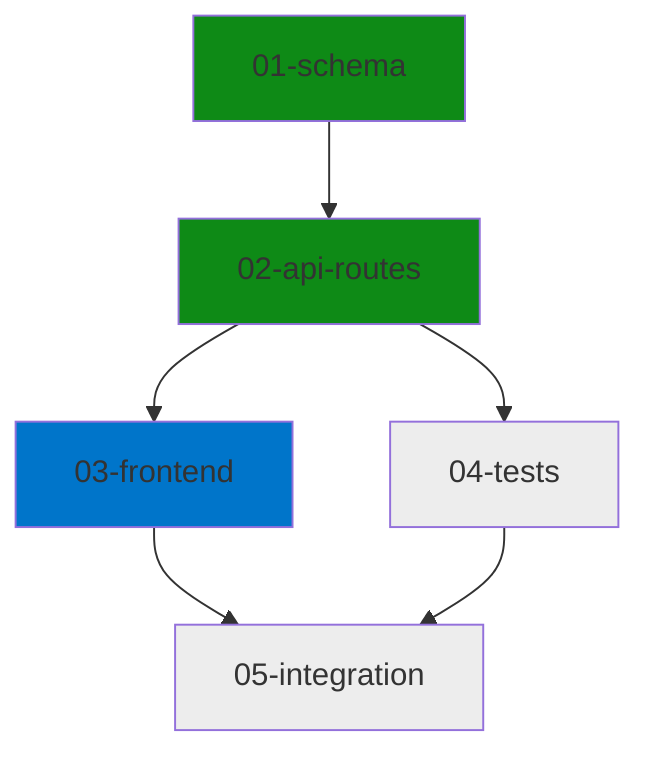
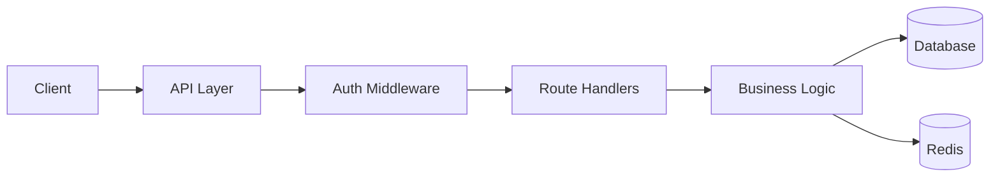
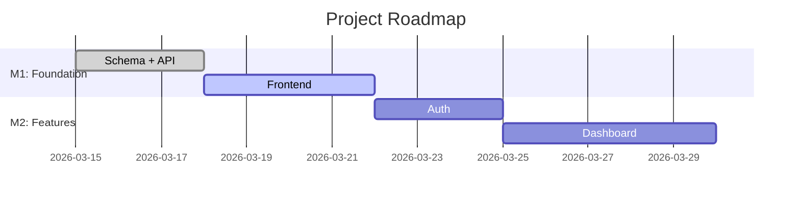

# Plan: OpenClaw Features for Maestro + Anthropic Ecosystem Integration

## Requirements

Bring OpenClaw's proven multi-agent assistant features to Maestro as a Claude Code plugin, optimized for the full Anthropic ecosystem (Claude Code terminal, Claude Code Desktop, Cowork, Agent SDK).

### Goal
Transform Maestro from a dev orchestrator into a full-stack AI development companion with notifications, visual output, proactive monitoring, voice interaction, and cross-platform compatibility.

### Constraints
- Pure markdown plugin (no Node.js runtime, no daemon)
- Must work in Claude Code terminal + Desktop + Cowork
- Integrations via MCP servers, webhooks, and Claude Code native features
- No persistent background connections (poll/webhook model instead)

### Out of Scope
- OpenClaw's gateway/daemon architecture
- Mobile companion apps
- Chrome extension relay for personal browser control
- Phone/Twilio calling integration

---

## Architecture

### Phase 1: Notifications & Webhooks (4 stories)

**New skill:** `plugins/maestro/skills/notify/SKILL.md`
- Provider-agnostic notification system
- Providers: Slack (webhook URL), Discord (webhook URL), Telegram (bot API), GitHub (commit status)
- Triggered at: story completion, feature completion, QA rejection, self-heal failure, test regression
- Config in `.maestro/config.yaml` under `notifications`

**New skill:** `plugins/maestro/skills/notify/provider-slack.md`
- Uses Slack incoming webhook URL (simple HTTP POST via bash curl)
- Formats messages with blocks: story title, status, cost, next action
- No MCP server needed — just a webhook URL in config

**New skill:** `plugins/maestro/skills/notify/provider-discord.md`
- Uses Discord webhook URL (HTTP POST via bash curl)
- Formats messages with embeds: color-coded by status

**New skill:** `plugins/maestro/skills/notify/provider-telegram.md`
- Uses Telegram Bot API (HTTP POST via bash curl)
- Sends to configured chat_id
- HTML-formatted messages

**New skill:** `plugins/maestro/skills/webhooks/SKILL.md`
- Inbound webhook processing
- Polls a webhook queue file (`.maestro/webhooks/queue.json`) written by external service
- Routes events: GitHub PR → auto-build, CI failure → alert, deploy → status update
- Uses `/loop` or CronCreate for periodic polling

**New command:** `plugins/maestro/commands/notify.md`
- `/maestro notify "message"` — send ad-hoc notification to configured channels
- `/maestro notify setup` — interactive setup for notification providers
- `/maestro notify test` — send test message to verify connectivity

**Config additions:**
```yaml
notifications:
  enabled: false
  providers:
    slack:
      webhook_url: null
    discord:
      webhook_url: null
    telegram:
      bot_token: null
      chat_id: null
  triggers:
    on_story_complete: true
    on_feature_complete: true
    on_qa_rejection: true
    on_self_heal_failure: true
    on_test_regression: true
```

**Integration points:**
- dev-loop/SKILL.md: send notification at CHECKPOINT phase
- ship/SKILL.md: send notification on PR creation
- watch/SKILL.md: send notification on regression detection

### Phase 2: Visual Dashboards & Diagrams (3 stories)

**New skill:** `plugins/maestro/skills/visualize/SKILL.md`
- Generate Mermaid diagrams and ASCII dashboards
- Types: dependency graph, architecture diagram, roadmap timeline, progress dashboard
- Output format: Mermaid code blocks (rendered by Claude Code Desktop and most markdown viewers)

**Diagram types:**

1. **Dependency Graph** (stories)


2. **Architecture Diagram** (system components)


3. **Roadmap Timeline** (milestones)


4. **Progress Dashboard** (ASCII art for terminal)
```
+---------------------------------------------+
| Feature: Add user authentication            |
+---------------------------------------------+
  [===========>      ] 3/5 stories  60%

  01 schema        (ok)  QA 1st pass   $0.65
  02 api-routes    (ok)  QA 1st pass   $0.95
  03 frontend      >>    implementing  ...
  04 tests         --    pending
  05 integration   --    pending

  Tokens  87,200 / ~145,000 estimated
  Cost    $2.40 / ~$3.80 estimated
  Time    8m 22s elapsed
```

**New command:** `plugins/maestro/commands/viz.md`
- `/maestro viz` — show progress dashboard
- `/maestro viz deps` — show story dependency graph
- `/maestro viz arch` — show architecture diagram
- `/maestro viz roadmap` — show milestone timeline

**Integration:**
- decompose/SKILL.md: generate dependency graph after decomposition
- architecture/SKILL.md: generate architecture diagram after design
- opus-loop/SKILL.md: generate roadmap timeline after milestone planning
- dev-loop/SKILL.md: update progress dashboard at each checkpoint

### Phase 3: Enhanced Proactive Monitoring (3 stories)

**Enhance:** `plugins/maestro/skills/watch/SKILL.md`
- Add heartbeat mode: periodic awareness checks that look for anomalies
- Not just running tests — analyze code for patterns, check for dependency updates, review recent commits for quality
- Trigger notifications on findings

**New skill:** `plugins/maestro/skills/awareness/SKILL.md`
- Heartbeat-style monitoring (OpenClaw pattern)
- Checks every 30 minutes (configurable):
  1. Run quality gates (tsc, lint, tests)
  2. Check for dependency security advisories (`npm audit`)
  3. Review recent git commits for convention violations
  4. Check `.maestro/notes.md` for unprocessed user notes
  5. Analyze test coverage trends
- Output: awareness report in `.maestro/logs/awareness-{date}.md`
- If issues found: notify via configured channels + add to notes.md

**Enhance:** `plugins/maestro/agents/proactive.md`
- Add awareness capabilities beyond simple health checks
- Can suggest refactoring opportunities based on code patterns
- Can identify tech debt accumulation
- Reports findings in daily briefing

**Config additions:**
```yaml
awareness:
  enabled: false
  interval_minutes: 30
  checks:
    quality_gates: true
    dependency_audit: true
    convention_review: true
    coverage_trends: true
    tech_debt_scan: false
```

### Phase 4: Voice & Anthropic Ecosystem (3 stories)

**New skill:** `plugins/maestro/skills/voice/SKILL.md`
- Map Claude Code's native `/voice` mode to Maestro commands
- Voice command patterns:
  - "Build [feature]" → `/maestro "feature"`
  - "What's the status?" → `/maestro status`
  - "Show the board" → `/maestro board`
  - "Plan [feature]" → `/maestro plan "feature"`
- TTS output guidance: structured responses optimized for audio (short, clear, no tables)

**New skill:** `plugins/maestro/skills/ecosystem/SKILL.md`
- Cross-platform compatibility layer for Anthropic ecosystem
- Detects environment: Claude Code Terminal, Claude Code Desktop, Cowork
- Adapts output:
  - Terminal: ASCII art, text-based progress bars
  - Desktop: Mermaid diagrams, rich markdown
  - Cowork: Structured file outputs (Excel, PowerPoint compatible)
- Documents Agent SDK integration patterns for programmatic Maestro control

**Enhance:** `plugins/maestro/commands/maestro.md`
- Detect environment at startup
- Adjust output format based on capability detection
- Add `/maestro ecosystem` subcommand for environment info

**New file:** `plugins/maestro/skills/ecosystem/cowork-adapter.md`
- Instructions for running Maestro in Cowork environment
- File output formats (structured data, spreadsheets)
- Multi-step task delegation via Cowork's workflow engine

**New file:** `plugins/maestro/skills/ecosystem/agent-sdk-adapter.md`
- Instructions for programmatic Maestro control via Agent SDK
- Python/TypeScript code examples for:
  - Starting a Maestro session programmatically
  - Reading status and progress
  - Triggering specific phases
  - Extracting build reports

### Phase 5: Advanced Skill Generation & Self-Improvement (2 stories)

**Enhance:** `plugins/maestro/skills/skill-factory/SKILL.md`
- OpenClaw-inspired autonomous skill creation
- When Maestro encounters a recurring task pattern, it can:
  1. Detect the pattern (e.g., "user always asks for specific deployment flow")
  2. Propose a new skill to automate it
  3. Generate the SKILL.md with full specification
  4. Register it for immediate use
- Skills can also be generated from user prompts: "Create a skill for [task]"

**Enhance:** `plugins/maestro/skills/retrospective/SKILL.md`
- OpenClaw-inspired self-improvement loop
- After each feature, analyze:
  1. Which skills were most/least useful?
  2. Were there tasks that needed a skill but didn't have one?
  3. Did any agent consistently underperform?
  4. Were there token-wasting patterns?
- Auto-generate improvement proposals with confidence scores

---

## Stories

### Story 1: Notification Skill + Slack Provider
Type: fullstack | Complexity: medium | Depends: none
- Create `skills/notify/SKILL.md` (provider abstraction)
- Create `skills/notify/provider-slack.md` (curl-based webhook)
- Add `notifications` section to config template
- Test with mock webhook

### Story 2: Discord + Telegram Notification Providers
Type: fullstack | Complexity: simple | Depends: [1]
- Create `skills/notify/provider-discord.md`
- Create `skills/notify/provider-telegram.md`
- Add setup instructions for each

### Story 3: Notify Command + Integration Hooks
Type: fullstack | Complexity: medium | Depends: [1]
- Create `commands/notify.md` (send, setup, test)
- Add notification hooks to dev-loop, ship, watch skills
- AskUserQuestion for provider setup

### Story 4: Webhook Processing Skill
Type: backend | Complexity: complex | Depends: [1]
- Create `skills/webhooks/SKILL.md`
- Create `skills/webhooks/github-events.md`
- Define polling mechanism using CronCreate
- Queue file format for `.maestro/webhooks/`

### Story 5: Visualization Skill + Mermaid Diagrams
Type: fullstack | Complexity: medium | Depends: none
- Create `skills/visualize/SKILL.md`
- Define dependency graph, architecture, roadmap, progress templates
- Mermaid code block generation

### Story 6: Viz Command + Integration
Type: fullstack | Complexity: medium | Depends: [5]
- Create `commands/viz.md`
- Add diagram generation to decompose, architecture, opus-loop
- ASCII progress dashboard for terminal

### Story 7: Progress Dashboard in Dev-Loop
Type: frontend | Complexity: simple | Depends: [5]
- Add real-time progress dashboard output to dev-loop checkpoints
- Update status command to show visual progress
- ASCII + Mermaid dual output

### Story 8: Awareness Skill (Heartbeat Monitoring)
Type: backend | Complexity: complex | Depends: none
- Create `skills/awareness/SKILL.md`
- Define 5 awareness checks
- CronCreate/loop integration
- Awareness report format

### Story 9: Enhanced Proactive Agent
Type: backend | Complexity: medium | Depends: [8]
- Enhance `agents/proactive.md` with awareness capabilities
- Tech debt detection, refactoring suggestions
- Daily briefing enhancements

### Story 10: Notification Integration for Awareness
Type: fullstack | Complexity: simple | Depends: [3, 8]
- Connect awareness findings to notification channels
- Alert formatting for each provider
- Configurable alert thresholds

### Story 11: Voice Command Skill
Type: fullstack | Complexity: medium | Depends: none
- Create `skills/voice/SKILL.md`
- Voice-to-command mapping
- TTS-optimized output guidelines

### Story 12: Ecosystem Compatibility Skill
Type: fullstack | Complexity: complex | Depends: none
- Create `skills/ecosystem/SKILL.md`
- Environment detection (terminal, desktop, cowork)
- Output adaptation per environment
- Create `skills/ecosystem/cowork-adapter.md`
- Create `skills/ecosystem/agent-sdk-adapter.md`

### Story 13: Ecosystem Integration in Commands
Type: fullstack | Complexity: medium | Depends: [12]
- Add ecosystem detection to maestro.md
- Adapt all command outputs for detected environment
- Add `/maestro ecosystem` subcommand

### Story 14: Enhanced Skill Factory
Type: backend | Complexity: complex | Depends: none
- Enhance `skills/skill-factory/SKILL.md`
- Pattern detection for recurring tasks
- Autonomous skill generation with validation
- Skill registration workflow

### Story 15: Self-Improvement Retrospective
Type: backend | Complexity: medium | Depends: [14]
- Enhance `skills/retrospective/SKILL.md`
- Skill usefulness analysis
- Agent performance tracking
- Auto-generate improvement proposals

---

## Dependency Graph

```
Phase 1 (Notifications):     1 -> 2, 1 -> 3, 1 -> 4
Phase 2 (Visuals):            5 -> 6, 5 -> 7
Phase 3 (Monitoring):         8 -> 9, [3,8] -> 10
Phase 4 (Voice/Ecosystem):    11, 12 -> 13
Phase 5 (Self-Improvement):   14 -> 15

Parallel: [1, 5, 8, 11, 12, 14] can start simultaneously
```

## Validation

- All new files are markdown (SKILL.md pattern)
- Notification providers use bash curl (no runtime dependency)
- Mermaid diagrams render in Claude Code Desktop + GitHub
- Config schema is backward-compatible (new sections, no breaking changes)
- All commands use AskUserQuestion for user decisions
