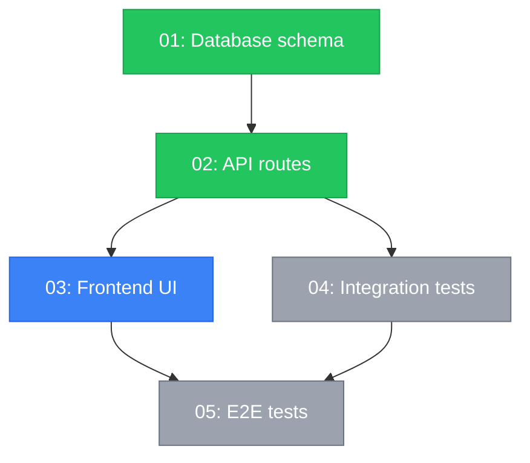

# Maestro Deps

**ALWAYS display this ASCII banner as the FIRST thing in your response, before any other output:**

```
███╗   ███╗ █████╗ ███████╗███████╗████████╗██████╗  ██████╗
████╗ ████║██╔══██╗██╔════╝██╔════╝╚══██╔══╝██╔══██╗██╔═══██╗
██╔████╔██║███████║█████╗  ███████╗   ██║   ██████╔╝██║   ██║
██║╚██╔╝██║██╔══██║██╔══╝  ╚════██║   ██║   ██╔══██╗██║   ██║
██║ ╚═╝ ██║██║  ██║███████╗███████║   ██║   ██║  ██║╚██████╔╝
╚═╝     ╚═╝╚═╝  ╚═╝╚══════╝╚══════╝   ╚═╝   ╚═╝  ╚═╝ ╚═════╝
```

Visualize story dependencies as a Mermaid diagram or ASCII art. Understand why stories depend on each other and identify blocking paths, parallel opportunities, and execution order.

## Step 1: Check Prerequisites

1. Read `.maestro/config.yaml`. If it does not exist:
   ```
   [maestro] Not initialized. Run /maestro init first.
   ```
   Stop here.

2. Glob `.maestro/stories/*.md` to find all story files. If no stories found:
   ```
   [maestro] No stories found.

     (i) Stories are created when you run:
         /maestro "describe your feature"
         /maestro plan "describe your feature"
   ```
   Stop here.

3. Read `.maestro/state.local.md` for current session context (active story, phase).

## Step 2: Parse All Story Files

For each story file in `.maestro/stories/*.md`, read and extract from the YAML frontmatter:

- `id` — Story number (integer)
- `slug` — Kebab-case identifier
- `title` — Human-readable title
- `type` — Story type (frontend, backend, data, integration, infrastructure, test)
- `depends_on` — List of story IDs this story depends on (may be empty)
- `parallel_safe` — Whether this story can run in parallel
- `complexity` — simple, medium, or complex
- `model` — Recommended model

Derive the status for each story from `.maestro/state.local.md`:

| Status | How to Derive |
|--------|--------------|
| `done` | Story ID < current_story (unless marked skipped) |
| `in-progress` | Story ID == current_story and phase is implement/self_heal |
| `in-review` | Story ID == current_story and phase is qa_review |
| `pending` | Story ID > current_story |
| `skipped` | Explicitly marked skipped in state |
| `blocked` | All dependencies not yet `done` and story is next eligible |

If `.maestro/state.local.md` does not exist or has no active session, mark all stories as `pending`.

## Step 3: Handle Subcommands

Check `$ARGUMENTS` for a subcommand.

### No arguments or `graph` — Dependency Graph

#### 3a: Build the Dependency Graph

Construct an adjacency list from the parsed stories:

```
graph[story_id] = list of story_ids that depend on this story
depends[story_id] = list of story_ids this story depends on
```

Validate the graph:
- Check for cycles (a story cannot transitively depend on itself)
- Check for missing references (depends_on refers to a story that does not exist)
- Check for orphaned stories (no dependencies and nothing depends on them — these are roots or standalone)

If validation fails:

```
  (x) Dependency graph has issues:
      - Cycle detected: story 03 -> 05 -> 03
      - Missing reference: story 04 depends on story 99 (not found)

  (i) Fix story frontmatter and re-run /maestro deps
```

#### 3b: Generate Mermaid Diagram

Produce a Mermaid flowchart from the graph. Use status-based styling:



Display the Mermaid code block so the user can copy it or render it.

#### 3c: Generate ASCII Fallback

Also display an ASCII art representation for terminal viewing:

```
+---------------------------------------------+
| Dependency Graph                            |
+---------------------------------------------+

  Legend:
    [=] done   [>] in-progress   [ ] pending
    [~] skipped   [x] blocked

  01-schema [=]
    |
    v
  02-api-routes [=]
    |
    +---> 03-frontend [>]
    |       |
    |       v
    |     05-e2e-tests [ ]
    |       ^
    +---> 04-integration [ ]

  Parallel-safe: 03, 04 (can run simultaneously)

  Critical path: 01 -> 02 -> 03 -> 05
  Estimated: [N] sequential steps
```

#### 3d: Show Summary Statistics

```
  Summary:
    Total stories:    [N]
    Done:             [N] [=]
    In progress:      [N] [>]
    Pending:          [N] [ ]
    Skipped:          [N] [~]
    Blocked:          [N] [x]

    Critical path length:  [N] stories
    Parallel opportunities: [N] groups
    Max parallelism:        [N] stories at once
```

#### 3e: Offer Next Actions

Use AskUserQuestion:
- Question: "What would you like to do?"
- Header: "Deps"
- Options:
  1. label: "Explain a story's dependencies", description: "See why a specific story depends on others"
  2. label: "Show critical path", description: "Highlight the longest dependency chain"
  3. label: "Copy Mermaid diagram", description: "Get the Mermaid code for external rendering"
  4. label: "Done", description: "Return to normal operation"

### `explain STORY_ID` — Explain Dependencies

Parse `STORY_ID` from `$ARGUMENTS`. Accept formats:
- Numeric ID: `3`, `03`
- Full slug: `03-frontend`
- Partial match: `frontend`

If the story is not found:
```
[maestro] Story not found: "[STORY_ID]"

  Available stories:
    01-schema
    02-api-routes
    03-frontend
    04-integration
    05-e2e-tests
```
Stop here.

#### 4a: Read the Story

Read the full story file `.maestro/stories/[NN-slug].md`. Extract:
- `depends_on` list
- `files.create` — files this story creates
- `files.modify` — files this story modifies
- `files.reference` — files this story references
- `acceptance_criteria` — what this story must achieve

#### 4b: Read Dependencies

For each story ID in `depends_on`, read the corresponding story file and extract the same fields.

#### 4c: Analyze Why Dependencies Exist

For each dependency, determine the reason by cross-referencing file lists:

| Reason | Detection |
|--------|-----------|
| **File dependency** | Upstream story creates a file that downstream modifies or references |
| **Schema dependency** | Upstream creates/modifies DB schema, downstream reads from it |
| **API dependency** | Upstream creates API routes, downstream calls them |
| **Component dependency** | Upstream creates a component, downstream imports it |
| **Config dependency** | Upstream sets up config/env, downstream relies on it |
| **Test dependency** | Downstream tests functionality created by upstream |

#### 4d: Display the Explanation

```
+---------------------------------------------+
| Story Dependencies: 03-frontend             |
+---------------------------------------------+

  Story:   03 — Frontend UI
  Status:  in-progress
  Type:    frontend
  Model:   sonnet

  Depends on:
    02-api-routes [=] done
      Reason:  API dependency
      Detail:  Story 03 calls endpoints created by story 02:
               - GET /api/users (created in 02)
               - POST /api/users (created in 02)
      Files:   02 creates src/routes/users.ts
               03 references src/routes/users.ts

  Depended on by:
    05-e2e-tests [ ] pending
      Reason:  Test dependency
      Detail:  Story 05 tests the UI created by story 03:
               - Tests login form (created in 03)
               - Tests user dashboard (created in 03)
      Files:   03 creates src/pages/Login.tsx
               05 references src/pages/Login.tsx

  Prerequisite state needed:
    (ok) Database schema must exist (story 01 — done)
    (ok) API routes must be functional (story 02 — done)
    --   No config or env prerequisites

  Blocking analysis:
    (ok) All dependencies satisfied — story is ready to execute.
```

If the story is blocked:

```
  Blocking analysis:
    (x) BLOCKED — cannot execute until dependencies are met:
        (x) Story 02-api-routes is still in-progress
        (i) Estimated time to unblock: when story 02 completes
```

#### 4e: Offer Next Actions

Use AskUserQuestion:
- Question: "What would you like to do?"
- Header: "Explain"
- Options:
  1. label: "Show full graph", description: "Return to the dependency graph view"
  2. label: "Explain another story", description: "Look at a different story's dependencies"
  3. label: "Done", description: "Return to normal operation"

### `critical-path` — Show Critical Path

Calculate the longest path through the dependency graph (the critical path that determines minimum build time).

```
+---------------------------------------------+
| Critical Path                               |
+---------------------------------------------+

  Longest chain: 4 steps

  01-schema  ->  02-api  ->  03-frontend  ->  05-e2e
     [=]           [=]          [>]              [ ]
    ~20K          ~35K         ~35K             ~20K
    ~$0.65        ~$1.10       ~$1.10           ~$0.65

  Total on critical path: ~110K tokens, ~$3.50
  Off critical path: 04-integration (parallel with 03)

  (i) Stories off the critical path can run in parallel
      without affecting total build time.
```

## Graph Algorithms

### Topological Sort

Use Kahn's algorithm to determine execution order:

1. Find all stories with no dependencies (roots)
2. Process roots, remove their edges
3. Find new stories with no remaining dependencies
4. Repeat until all stories are processed

The result is the valid execution order respecting all dependencies.

### Cycle Detection

During topological sort, if not all stories are processed, a cycle exists. Report the cycle by tracing back through the remaining edges.

### Critical Path

Use longest-path algorithm on the DAG:

1. Topologically sort stories
2. For each story in order, compute longest path from any root
3. The story with the maximum longest path determines the critical path
4. Trace back to reconstruct the full path

### Parallel Groups

Identify groups of stories that can execute simultaneously:

1. After topological sort, group stories by their "level" (distance from roots)
2. Stories at the same level with no mutual dependencies form a parallel group

## Integration Points

- **Decompose Skill**: produces the `depends_on` frontmatter this command reads
- **Board Command**: uses status derivation logic shared with deps
- **Dev-Loop**: respects dependency order during execution
- **Plan Command**: shows dependency graph during plan presentation
- **State**: reads `.maestro/state.local.md` for story status

## Error Handling

| Error | Action |
|-------|--------|
| No stories directory | Prompt to run `/maestro` first |
| Cycle in dependencies | Report the cycle, suggest fix |
| Missing dependency reference | Warn, show the broken reference |
| State file missing | Show all stories as pending |
| Story file malformed | Skip story, warn user |

## Output Contract

```yaml
output_contract:
  display:
    format: "box-drawing"
    sections:
      - "Dependency Graph header"
      - "Mermaid code block"
      - "ASCII graph"
      - "Summary statistics"
  subcommands:
    graph:
      output: "Mermaid diagram + ASCII fallback + summary"
    explain:
      output: "Story dependency analysis with reasons"
    critical-path:
      output: "Longest chain with token estimates"
  user_decision:
    tool: "AskUserQuestion"
    options: ["Explain a story", "Critical path", "Copy Mermaid", "Done"]
  data_read:
    - ".maestro/stories/*.md"
    - ".maestro/state.local.md"
    - ".maestro/config.yaml"
```
