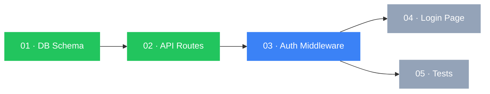
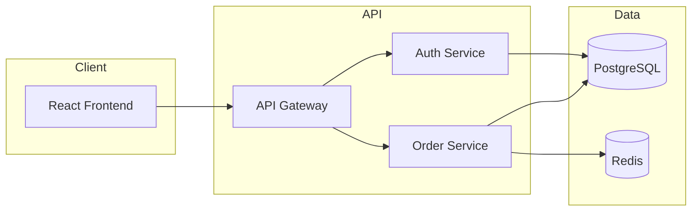
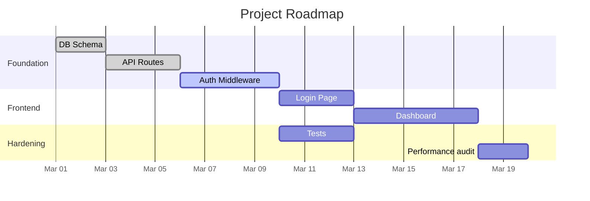

# Maestro Viz

**ALWAYS display this ASCII banner as the FIRST thing in your response, before any other output:**

```
███╗   ███╗ █████╗ ███████╗███████╗████████╗██████╗  ██████╗
████╗ ████║██╔══██╗██╔════╝██╔════╝╚══██╔══╝██╔══██╗██╔═══██╗
██╔████╔██║███████║█████╗  ███████╗   ██║   ██████╔╝██║   ██║
██║╚██╔╝██║██╔══██║██╔══╝  ╚════██║   ██║   ██╔══██╗██║   ██║
██║ ╚═╝ ██║██║  ██║███████╗███████║   ██║   ██║  ██║╚██████╔╝
╚═╝     ╚═╝╚═╝  ╚═╝╚══════╝╚══════╝   ╚═╝   ╚═╝  ╚═╝ ╚═════╝
```

Generate visual diagrams and dashboards for the current Maestro session or project.

## Step 1: Check Data

Read `.maestro/state.local.md` and `.maestro/dna.md`. If neither exists:

```
[maestro] No project data to visualize. Run /maestro init first.
```

## Step 2: Handle Arguments

### No arguments — Show what's available

Check which data exists and offer the relevant visualizations:

Use AskUserQuestion:
- Question: "What would you like to visualize?"
- Header: "Viz"
- Options (only show what's available):
  1. label: "Progress dashboard", description: "Current session progress with story status and costs"
  2. label: "Story dependencies", description: "Mermaid graph showing story execution order"
  3. label: "Architecture diagram", description: "System component diagram from .maestro/architecture.md"
  4. label: "Roadmap timeline", description: "Mermaid Gantt chart from milestone data"
  5. label: "Cost breakdown", description: "Model cost matrix and spending analysis"

---

### `deps` — Story Dependency Graph

1. Read all files in `.maestro/stories/`
2. Parse frontmatter: `id`, `title`, `depends_on`, `status`
3. Derive status from `.maestro/state.local.md`
4. Generate a Mermaid `graph LR` with status-coded node styles
5. Always emit the ASCII fallback immediately after the Mermaid block

**Mermaid output format:**



**ASCII fallback (always emit this after the Mermaid block):**

```
Story Dependency Graph
======================

  [done]    01 DB Schema
      |
  [done]    02 API Routes
      |
  [active]  03 Auth Middleware
     / \
[pend] [pend]
  04     05
Login  Tests

Legend: [done] [active] [blocked] [pending]
```

**Node styling rules:**

| Status   | Mermaid class | ASCII label  |
|----------|---------------|--------------|
| done     | `:::done`     | `[done]`     |
| active   | `:::active`   | `[active]`   |
| blocked  | `:::blocked`  | `[BLOCKED]`  |
| pending  | `:::pending`  | `[pend]`     |
| skipped  | `:::pending`  | `[skip]`     |

If a story has no `depends_on`, it is a root node. If no dependency data exists in any story, render a simple linear chain in declared order.

---

### `arch` — Architecture Diagram

1. Read `.maestro/architecture.md`
2. If it doesn't exist: `"No architecture document found. Run /maestro plan first."`
3. Extract components (headers, bullet lists of services, modules, databases) and relationships (arrows, "calls", "reads from", "writes to" language)
4. Generate a Mermaid `graph LR` grouping components into subgraphs by layer

**Mermaid output format:**



**ASCII fallback:**

```
Architecture
============

  [Client]
    React Frontend
        |
  [API Gateway]
   /          \
[Auth]      [Orders]
  |            |  \
 [DB]         [DB] [Cache]
```

If `.maestro/architecture.md` contains an existing Mermaid block, extract it verbatim and render it rather than generating a new one.

---

### `roadmap` — Roadmap Timeline

1. Read `.maestro/roadmap.md` or glob `.maestro/milestones/*.md`
2. If neither exists: `"No roadmap found. Use /maestro magnum-opus to generate milestones."`
3. Parse milestones: title, start date, end date, status
4. Generate a Mermaid Gantt chart

**Mermaid output format:**



**ASCII fallback:**

```
Roadmap
=======

  Mar 01 ████████ DB Schema          [done]
  Mar 03 ████████████ API Routes     [done]
  Mar 06 ████████████████ Auth       [active]
  Mar 10 ············· Login Page    [pending]
  Mar 13 ················· Dashboard [pending]

  Today: Mar 18
```

If milestone data has no explicit dates, distribute evenly starting from the earliest git commit date.

---

### `progress` — Progress Dashboard

1. Read `.maestro/state.local.md` for session state (current story, status per story)
2. Read story files for titles
3. Read `.maestro/token-ledger.md` for costs
4. Always render in ASCII — no Mermaid — this must work in every terminal

**Output format:**

```
+-----------------------------------------------------+
| Session Progress                                    |
+-----------------------------------------------------+

  Feature   User Authentication
  Mode      checkpoint
  Started   2026-03-18 09:14

  Stories
    [ok] 01  DB Schema           $0.65   2m 10s
    [ok] 02  API Routes          $0.95   3m 05s
    [>>] 03  Auth Middleware      $0.40   1m 30s  ← in progress
    [  ] 04  Login Page
    [  ] 05  Tests

  Progress  3/5  [████████████░░░░░░░░]  60%

  Cost so far  $2.00
  Elapsed      6m 45s
  ETA          ~4m remaining

+-----------------------------------------------------+
```

Progress bar formula: `filled = round(completion_pct / 5)`, bar width = 20 chars.

If `.maestro/state.local.md` does not exist, fall back to `.maestro/state.md` for the most recent completed session.

---

### `cost` — Cost Breakdown

1. Read `.maestro/token-ledger.md`
2. Read `.maestro/config.yaml` for model assignments
3. Generate ASCII cost matrix showing actual spend per model per task type
4. Show total spend, average per story, and a sparkline cost trend

**Output format:**

```
+-----------------------------------------------------+
| Cost Breakdown                                      |
+-----------------------------------------------------+

  Summary
    Total spend       $8.15
    Total stories     10
    Total sessions    3
    Avg per story     $0.82
    Avg per session   $2.72

  Model Breakdown
    Model         Spend    Share   Stories  Avg/Story
    -----------   ------   -----   -------  ---------
    Sonnet 3.5    $5.40    66%     8        $0.68
    Opus 3        $2.75    34%     5 (QA)   $0.55

  Per-Task Breakdown
    Task Type       Model       Avg Cost
    ------------    --------    --------
    Decompose       Sonnet      $0.15
    Implement       Sonnet      $0.55
    QA Review       Opus        $0.55
    Self-Heal       Sonnet      $0.20

  Cost Trend (last 7 sessions)
    Session         Stories   Cost
    Mar 10          3         $2.85   ▄▄▄▄▄▄▄▄▄
    Mar 12          2         $1.10   ███
    Mar 15          5         $4.20   █████████████

  Sparkline: ▄ ▂ █

  Tips
    (i) Lower costs: use --yolo for well-understood tasks
    (i) Cheaper model: /maestro model set execution haiku
    (i) Most expensive story this week: Auth Middleware ($1.10)
```

If `.maestro/token-ledger.md` does not exist:

```
+---------------------------------------------+
| Cost Breakdown                              |
+---------------------------------------------+
  (i) No cost data found.
  (i) Cost tracking starts automatically when you build features.
  (i) Disable with: /maestro config set cost_tracking.enabled false
```

Sparkline character map: `▁▂▃▄▅▆▇█` — map values linearly to 8 buckets relative to the max value in the series.

---

## Output Contract

Every `viz` invocation emits output in this order:

1. ASCII banner (mandatory)
2. Mermaid diagram block (for `deps`, `arch`, `roadmap`) — fenced with ` ```mermaid `
3. ASCII fallback block (for `deps`, `arch`, `roadmap`) — always present, immediately after Mermaid
4. ASCII dashboard (for `progress`, `cost`) — no Mermaid, just boxes and bars
5. AskUserQuestion prompt (when no subcommand was given)

**Never silently skip a section.** If data is missing, say so explicitly with `(i)` info lines rather than omitting the block entirely. This allows the user to know what data to add.
