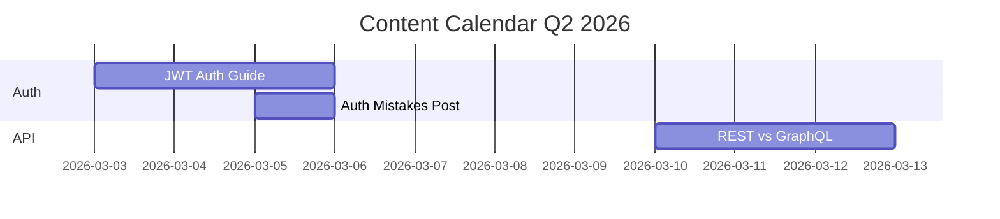

# Content Calendar

Build structured content calendars with keyword research, topic clustering, and scheduling.

## Input

- Audience: who is the content for?
- Topics/pillars: 3-5 content themes
- Duration: 1, 3, 6, or 12 months
- Frequency: posts per week (1-5)
- Formats: blog, email, social, video

## Process

### 1. Research

WebSearch for trending topics in the domain:

```
"[audience] [pillar] trending topics 2026"
"[audience] content ideas"
"[pillar] keywords search volume"
```

### 2. Keyword Clustering

Group related keywords into content pillars:

| Pillar | Keywords | Monthly Searches |
|--------|----------|-----------------|
| Auth | authentication, OAuth, JWT, SSO | 12,000 |
| API Design | REST, GraphQL, tRPC, OpenAPI | 8,500 |
| Testing | unit tests, E2E, TDD, coverage | 6,200 |

### 3. Topic Generation

For each pillar, create specific article titles:

- "[How to / Why / What] [topic] [for audience]"
- "[N] [things/tips/mistakes] [about topic]"
- "[Topic] vs [Alternative]: [comparison angle]"
- "[Year] Guide to [topic]"

### 4. Scheduling

Assign dates based on frequency and pillar rotation:

```
Week 1: Pillar A (blog) + Pillar B (social)
Week 2: Pillar C (blog) + Pillar A (email)
Week 3: Pillar B (blog) + Pillar C (social)
```

### 5. Priority Scoring

Rank topics by:
- Search volume (estimated)
- Competition level
- Relevance to audience
- Alignment with business goals

## Output

Save to `.maestro/content-calendar.md`:

```markdown
# Content Calendar — [Audience]

## Overview
- Duration: [N] months ([start] to [end])
- Frequency: [N] posts/week
- Pillars: [list]
- Total pieces: [N]

## Month 1: [Month Year]

| Week | Date | Title | Pillar | Format | Keywords | Priority |
|------|------|-------|--------|--------|----------|----------|
| 1 | Mar 3 | How to Add JWT Auth in Next.js | Auth | Blog | JWT, Next.js, auth | High |
| 1 | Mar 5 | 5 Auth Mistakes Developers Make | Auth | Social | auth, security | Medium |
| 2 | Mar 10 | REST vs GraphQL in 2026 | API | Blog | REST, GraphQL | High |
```

## Visualization

Generate Mermaid Gantt chart:



## Output Contract

```yaml
output_contract:
  file_pattern: ".maestro/content-calendar.md"
  required_sections:
    - "## Overview"
    - "## Month 1"
  required_frontmatter:
    audience: string
    duration_months: integer
    frequency: string
    pillars: list
  min_words: 500
```

## Integration

- Content pipeline uses calendar entries as input
- Each calendar entry can become a `/maestro "Write [title]"` command
- Brain saves calendar decisions for cross-session continuity
