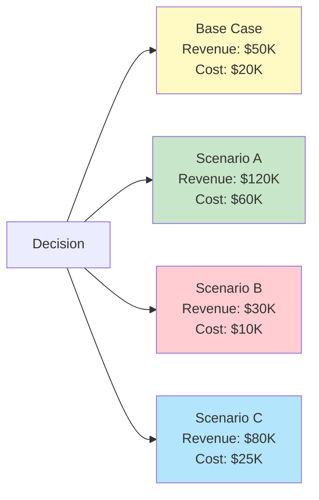
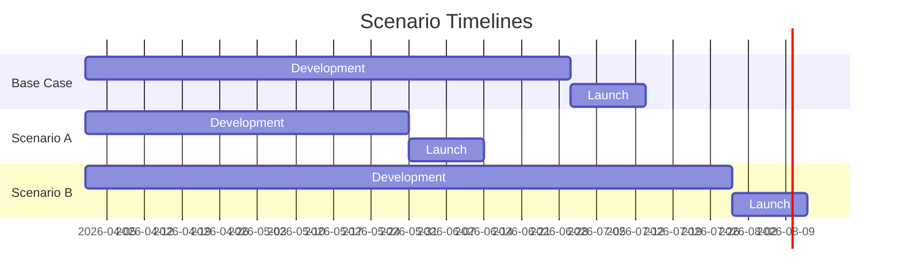
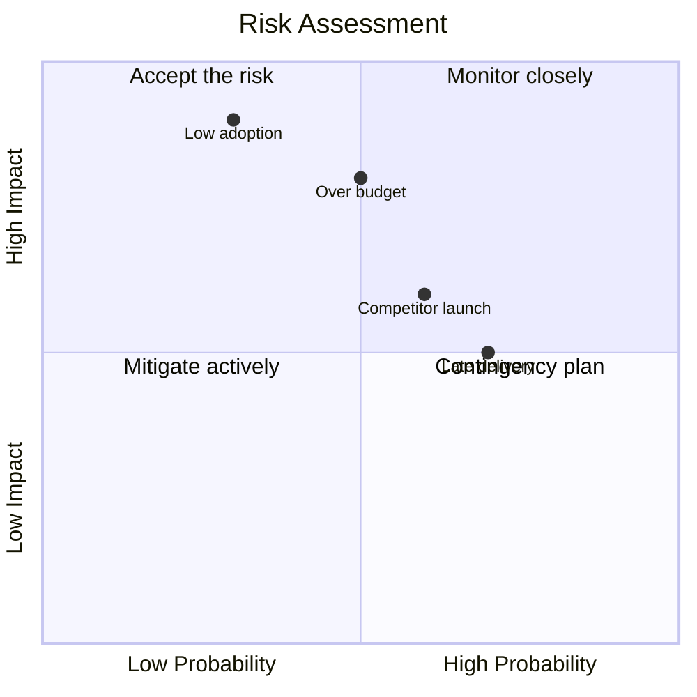

# Scenario Planning

Run structured what-if analyses for strategic decision-making. Define a base case and alternative scenarios, project outcomes across multiple dimensions, identify which variables have the most impact, and produce comparison matrices with Mermaid visualizations.

## Input

- **question** — The strategic question to analyze (from `$ARGUMENTS`)
- **Optional:** `.maestro/strategy.md` for current positioning and KPI targets
- **Optional:** `.maestro/research.md` for market data and competitor context
- **Optional:** `.maestro/vision.md` for constraints and success criteria
- **Optional:** existing scenario file for iteration or refinement

## Process

### Step 1: Frame the Decision

Every scenario analysis starts with a clear decision frame:

1. **Decision statement** — What specific choice or fork are we analyzing?
2. **Time horizon** — Over what period do we project outcomes? (30/90/180/365 days)
3. **Stakeholders** — Who is affected by this decision?
4. **Constraints** — What is fixed regardless of scenario (budget caps, headcount, regulatory)?
5. **Success metric** — What single metric determines the best scenario?

Read available context files (`.maestro/strategy.md`, `.maestro/research.md`, `.maestro/vision.md`) to ground the analysis in real project data. If none exist, work from the user's input alone.

```
+---------------------------------------------+
| Decision Frame                               |
+---------------------------------------------+
  Question:    [decision statement]
  Horizon:     [time period]
  Constraint:  [key constraint]
  Success:     [primary metric]
```

### Step 2: Define Scenarios

Create 3-5 scenarios including a base case:

| Scenario | Description | Key Assumption |
|----------|-------------|----------------|
| **Base case** | Current trajectory, no changes | Status quo continues |
| **Scenario A** | [Optimistic or aggressive option] | [What must be true] |
| **Scenario B** | [Conservative or defensive option] | [What must be true] |
| **Scenario C** | [Wildcard or disruption scenario] | [What must be true] |

**Rules for good scenarios:**
- Each scenario must be plausible, not fantasy
- Scenarios should be mutually exclusive (you pick one path)
- The base case is "do nothing" or "continue as planned"
- At least one scenario should challenge the team's assumptions
- Each scenario has a clear, testable assumption that makes it distinct

### Step 3: Define Variables

Identify the input variables that change across scenarios:

```markdown
## Variables

| Variable | Base Case | Scenario A | Scenario B | Scenario C |
|----------|-----------|-----------|-----------|-----------|
| Monthly budget | $5,000 | $15,000 | $3,000 | $5,000 |
| Team size | 3 | 5 | 2 | 3 |
| Launch date | Q3 2026 | Q2 2026 | Q4 2026 | Q3 2026 |
| Pricing model | Freemium | Paid only | Free + ads | Usage-based |
| Marketing channel | Organic | Paid + organic | Organic only | Partnership |
```

**Variable types:**
- **Quantitative** — Numbers that can be modeled (budget, headcount, price, timeline)
- **Qualitative** — Strategic choices that change the approach (pricing model, target market, tech stack)
- **External** — Factors outside our control (market growth, competitor actions, regulation)

### Step 4: Project Outcomes

For each scenario, project outcomes across these dimensions:

| Dimension | Base Case | Scenario A | Scenario B | Scenario C |
|-----------|-----------|-----------|-----------|-----------|
| **Revenue (period)** | $X | $Y | $Z | $W |
| **Total cost** | $X | $Y | $Z | $W |
| **Time to market** | X weeks | Y weeks | Z weeks | W weeks |
| **Risk level** | Low/Med/High | ... | ... | ... |
| **Team strain** | Low/Med/High | ... | ... | ... |
| **Market fit confidence** | Low/Med/High | ... | ... | ... |
| **Reversibility** | Easy/Hard | ... | ... | ... |

**Projection rules:**
- Show your reasoning for each projection, not just the number
- Use ranges when uncertainty is high (e.g., "$10K-$25K" not "$17.5K")
- Flag assumptions that are most likely to be wrong
- Note second-order effects (e.g., "aggressive timeline increases bug risk")

### Step 5: Sensitivity Analysis

Determine which variables have the most impact on outcomes. For each variable:

1. Hold all other variables at base case values
2. Vary the target variable across its range (low / base / high)
3. Measure the change in the primary success metric
4. Rank variables by impact

```
+---------------------------------------------+
| Sensitivity Ranking                          |
+---------------------------------------------+
  Rank  Variable          Impact on [metric]
  ----  ----------------  ----------------------
  1     Pricing model     +/- 45% revenue change
  2     Monthly budget    +/- 30% growth rate
  3     Launch date       +/- 20% market share
  4     Team size         +/- 15% velocity
  5     Marketing channel +/- 10% CAC
```

**Interpretation guidance:**
- **High-impact variables** (top 1-2): These are the decisions that matter most. Get them right and other variables are secondary.
- **Medium-impact variables** (3-4): Important but not make-or-break. Optimize after high-impact decisions are locked.
- **Low-impact variables** (5+): Nice to optimize but won't determine success or failure.

### Step 6: Risk Assessment

For each scenario, identify and rate risks:

```markdown
## Risk Matrix

| Risk | Probability | Impact | Scenario | Mitigation |
|------|------------|--------|----------|------------|
| Over budget | Medium | High | A | Set hard cap at 120% of budget |
| Late delivery | High | Medium | A | Cut scope, keep deadline |
| Low adoption | Low | High | B | Pre-launch waitlist validation |
| Competitor launch | Medium | Medium | All | Differentiate on [X] |
| Key person leaves | Low | High | All | Document everything, cross-train |
```

### Step 7: Recommendation

Based on the analysis, make a clear recommendation:

```
+---------------------------------------------+
| Recommendation                               |
+---------------------------------------------+
  Preferred:    Scenario [X]
  Rationale:    [2-3 sentences explaining why]

  Key actions:
    1. [First concrete step]
    2. [Second concrete step]
    3. [Third concrete step]

  Watch for:
    (!) [Risk to monitor]
    (!) [Assumption to validate]
    (!) [Trigger for plan B]

  Revisit:      [Date or milestone to reassess]
```

The recommendation should be opinionated. "It depends" is not acceptable. Take a position and defend it with the data from the analysis.

### Step 8: Mermaid Visualization

Generate a Mermaid chart showing scenario outcomes. Choose the most appropriate chart type:

**For quantitative comparisons (revenue, cost):**



**For timeline comparisons:**



**For risk/impact mapping:**



Include at least one Mermaid diagram in every scenario analysis.

### Step 9: Save Analysis

Save to `.maestro/scenarios/{YYYY-MM-DD}-{slug}.md`:

```markdown
---
type: scenario-analysis
status: draft | final
question: "the decision question"
scenarios_count: 4
preferred_scenario: "Scenario A"
time_horizon: "180 days"
created: YYYY-MM-DD
updated: YYYY-MM-DD
---

# Scenario Analysis: [Question]

## Decision Frame
[From Step 1]

## Scenarios
[From Step 2]

## Variables
[From Step 3]

## Outcome Projections
[From Step 4]

## Sensitivity Analysis
[From Step 5]

## Risk Matrix
[From Step 6]

## Recommendation
[From Step 7]

## Visualizations
[From Step 8]

## Revision Log
- [Date]: Initial analysis
```

## Output Contract

```yaml
output_contract:
  file: ".maestro/scenarios/{date}-{slug}.md"
  frontmatter:
    type: "enum(scenario-analysis)"
    status: "enum(draft,final)"
    question: string
    scenarios_count: "integer(2-6)"
    preferred_scenario: string
    time_horizon: string
    created: date
    updated: date
  required_sections:
    - "# Scenario Analysis:"
    - "## Decision Frame"
    - "## Scenarios"
    - "## Variables"
    - "## Outcome Projections"
    - "## Sensitivity Analysis"
    - "## Risk Matrix"
    - "## Recommendation"
    - "## Visualizations"
  min_words: 800
  max_words: 5000
```

## Integration Points

### With Strategy Skill

Reads `.maestro/strategy.md` for:
- Current positioning and KPI targets (used as base case inputs)
- Channel priorities (inform marketing-related scenarios)
- Growth experiments (scenarios can model experiment outcomes)

### With Research Skill

Reads `.maestro/research.md` for:
- Competitor data (inform competitive scenarios)
- Market sizing (ground revenue projections)
- Technology trends (inform build-vs-buy scenarios)

### With Content Validator

After saving, invoke content-validator to validate the output against the scenario analysis output contract. Ensures all required sections and frontmatter fields are present.

### With Forecast Skill

Scenario planning for development decisions can incorporate token cost forecasts:
- "What if we build feature X with Opus vs. Sonnet?"
- "What if we split this into 5 stories vs. 10?"

### With Brain

If brain is configured, store completed analyses for:
- Historical reference in future decisions
- Tracking which scenarios actually played out
- Building an organizational decision log

## Error Handling

| Error | Action |
|-------|--------|
| No question provided | Ask user for the strategic question |
| Context files missing | Proceed with user input only, note assumptions are ungrounded |
| Too few scenarios (< 2) | Require at least base case + 1 alternative |
| Too many scenarios (> 6) | Consolidate similar scenarios, max 6 for readability |
| Quantitative data unavailable | Use qualitative ratings (Low/Med/High) instead of numbers |
| Mermaid rendering not supported | Include the Mermaid code blocks anyway for downstream rendering |

## Example Invocation

```
/scenario-planning "Should we launch a freemium tier or stay paid-only for the next 6 months?"
```

Output:
```
[maestro] Decision framed: pricing strategy, 180-day horizon
[maestro] Scenarios defined: 4 (base + 3 alternatives)
[maestro] Variables: 5 inputs varying across scenarios
[maestro] Projections: revenue, cost, adoption, risk
[maestro] Sensitivity: pricing model is highest-impact variable
[maestro] Recommendation: Scenario B (freemium with usage limits)
[maestro] Saved: .maestro/scenarios/2026-03-17-freemium-vs-paid.md
```
