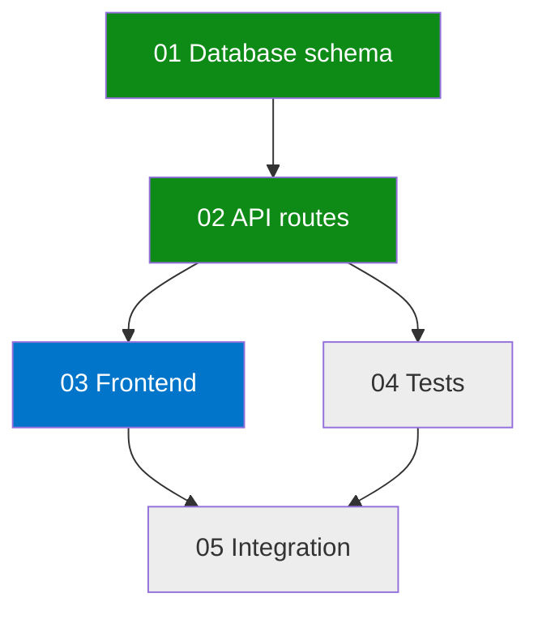
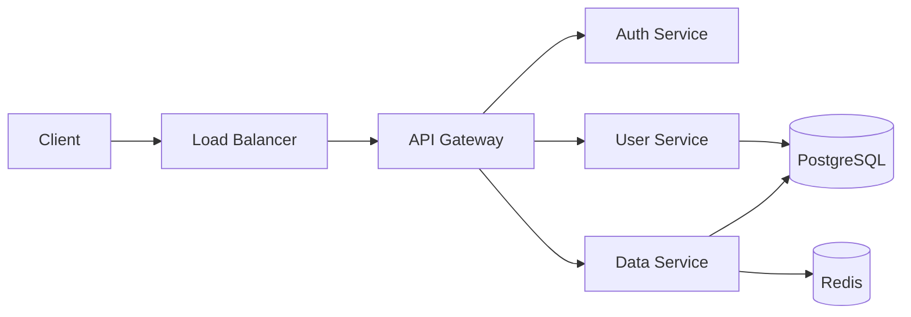
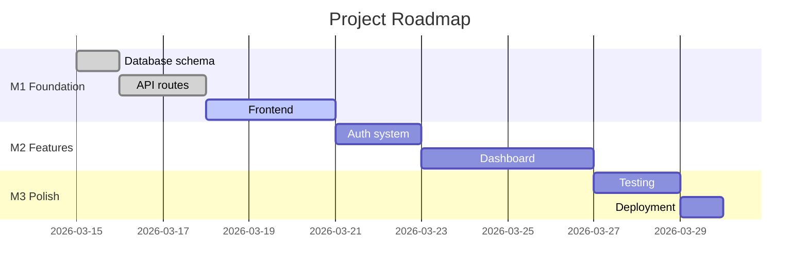

# Visualization Skill

Generate visual representations of Maestro data using Mermaid diagrams (rich rendering in Desktop/GitHub) and ASCII art (terminal compatible).

## Diagram Types

### 1. Story Dependency Graph

Shows story execution order with status colors.



**Status colors:**
- `#0e8a16` (green) — done
- `#0075ca` (blue) — in progress
- `#e4e669` (yellow) — skipped
- `#b60205` (red) — blocked/failed
- `#ededed` (gray) — pending

**How to generate:**
1. Read all story files from `.maestro/stories/`
2. Parse `depends_on` from each story's frontmatter
3. Determine status from `.maestro/state.local.md` (current_story, phase)
4. Build Mermaid graph with directional arrows and status styles

### 2. Architecture Diagram

Shows system component relationships.



**How to generate:**
1. Read `.maestro/architecture.md` if it exists
2. Extract components, services, databases from the architecture description
3. Map relationships as directional edges
4. Use shapes: `[]` for services, `[()]` for databases, `{}` for external

### 3. Roadmap Timeline (Opus)

Shows milestones over time.



**How to generate:**
1. Read `.maestro/roadmap.md` or milestone files
2. Calculate dates from story estimates
3. Mark status: `done`, `active`, or default (upcoming)

### 4. Progress Dashboard (ASCII)

Terminal-friendly progress display.

```
+---------------------------------------------+
| Feature: Add user authentication            |
+---------------------------------------------+

  [===========>      ] 3/5 stories  60%

  01 schema        (ok)  QA 1st     $0.65  2m
  02 api-routes    (ok)  QA 1st     $0.95  3m
  03 frontend      >>    building   ...    ...
  04 tests         --    pending
  05 integration   --    pending

  Tokens  87,200 / ~145,000 estimated
  Cost    $2.40 / ~$3.80 estimated
  Time    8m 22s elapsed
```

**How to generate:**
1. Read `.maestro/state.local.md` for current progress
2. Read all story files for titles and types
3. Read `.maestro/token-ledger.md` for per-story costs
4. Calculate progress bar width proportionally

### 5. Model Cost Matrix

Visual cost comparison.

```
  Model Cost per Story Type:

            Haiku    Sonnet   Opus
            ------   ------   ------
  planning  $0.02    $0.09    $0.45
  execution $0.07    $0.27    $1.35
  review    $0.02    $0.07    $0.36
  simple    $0.01    $0.03    $0.14
  research  $0.04    $0.14    $0.68
            ------   ------   ------
  total/f   $0.16    $0.60    $2.98
```

## Operations

### generate(type, format)

- `type`: deps | arch | roadmap | progress | cost
- `format`: mermaid | ascii | both

**Default behavior:** Use Mermaid for Desktop/GitHub, ASCII for terminal. If unsure, output both.

### For each diagram type, the skill:
1. Reads the relevant data source
2. Generates the diagram in the requested format
3. Returns the diagram as a markdown code block

## Integration Points

- **decompose/SKILL.md**: After story generation, auto-generate dependency graph
- **architecture/SKILL.md**: After design, auto-generate architecture diagram
- **opus-loop/SKILL.md**: After roadmap generation, auto-generate Gantt chart
- **dev-loop/SKILL.md**: At checkpoint, update progress dashboard
- **status command**: Include progress dashboard in status display
